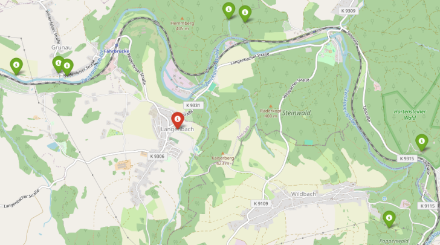

# Find Trip

#### Quick start:

`git clone https://github.com/hyearchom/find-trip`
`pip install osmnx`
`python findtrip --place 'Washigton' --distance 20`

- Use powershell with python to run the script
    
#### Description:

- This script finds random city from given point within distance and points of interests around it
- Everything is shown on the generated map which is saved withing the setting folder
- Previous result are saved in file `.dat` files and need to transfered to be used in "cached" version
- Script can choose random city without internet connection or on devices where Open Street Map module is hard to install (et. mobile phones, tablets...) **if history file is present in setting folder**

#### Output:

### Line arguments:

- `--place [-p]`
	- original point as center for searching nearby settlements
	- form should be address or part of address
	- example: 'New York', 'Times Square, New York', London
	- use quotation marks if you want to type addresses with multiple words
	- optional argument after setting default value (via`--home` argument)

- `--distance [-d]` 
	- distance from the place of origin where algoritmus is searching for target city
	- unit is kilometer
	- optional argument, default value is '20'

- `--point_distance [-pd]` 
	- distance from target city where algoritmus is searching for points of interest
	- unit is kilometer
	- optional argument, default value is '3'
	
- `--home`
	- saves default value for `--place` argument and ends script

- `--no_history [-n]`
	- prevent script from saving anything into data folder after search
	- this does not effect OSMX module, which creates cache folder by default if you try to search from a new place